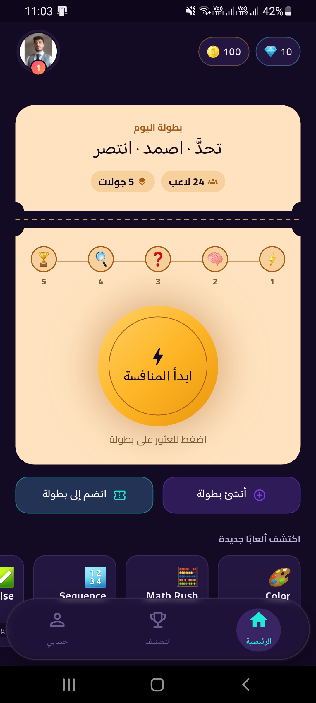
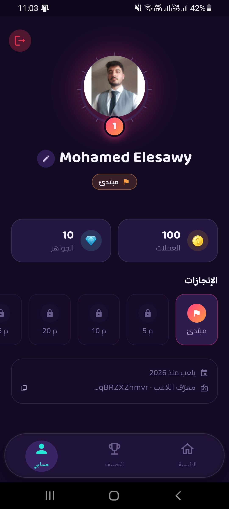
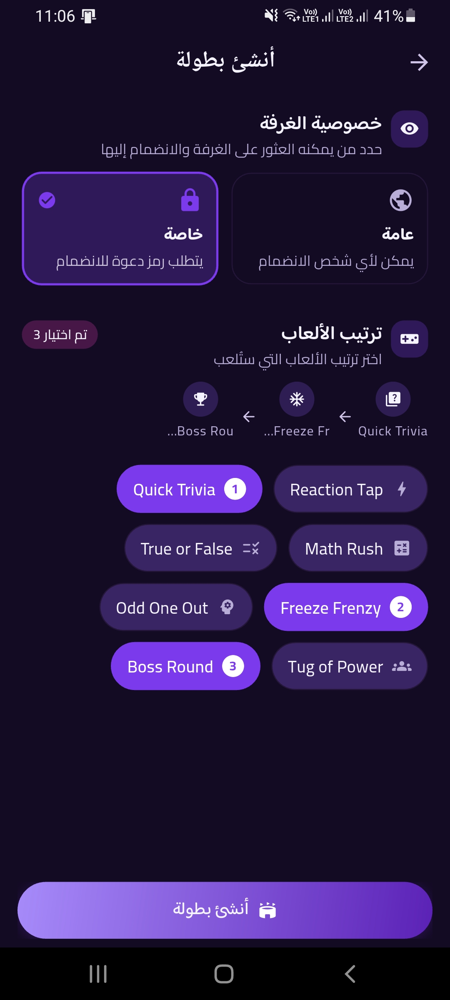
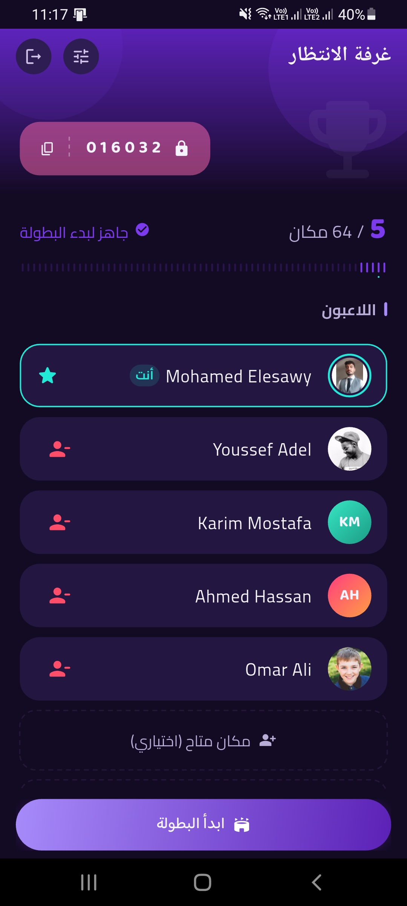
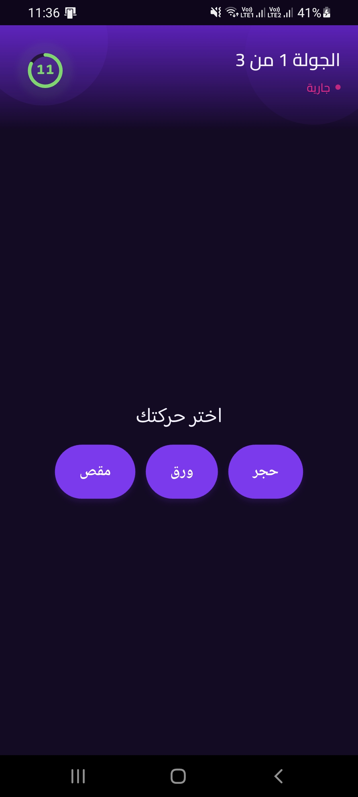
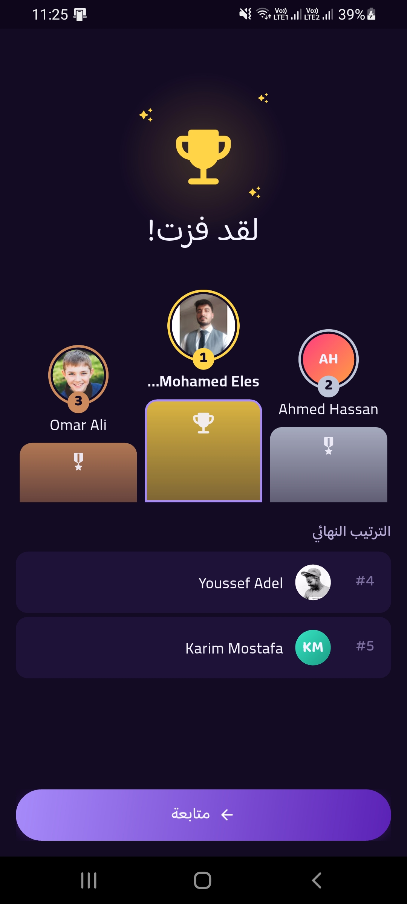

<div align="center">

# 🎮 Gawla

**Real-time multiplayer elimination tournament — join fast, play mini-games, survive the cut.**

<br/>

[](https://flutter.dev)
[](https://dart.dev)
[](https://bloclibrary.dev)
[](https://firebase.google.com)
[](LICENSE)

<br/>

[Features](#-features) · [Getting Started](#-getting-started) · [Architecture](#-architecture) · [Anti-Cheat](#-anti-cheat--security) · [License](#-license)

</div>

---

## 📖 Overview

```
Gawla is a real-time multiplayer party game where players join a live tournament
made up of several fast mini-games. After every round, a portion of the players
is eliminated — until only one winner remains.

Every mini-game has its own elimination rule (ranked cutoff, single-mistake fail,
head-to-head duel, survival timer, or team result), so the tournament never cuts
the pool the same way twice.

Built with Flutter and Firebase for real-time synchronized rooms, server-authoritative
gameplay, and a scalable, cheat-resistant backend.
```

---

## 📸 Screenshots

<div align="center">
<table>
  <tr>
    <td></td>
    <td></td>
    <td></td>
  </tr>
  <tr>
    <td></td>
    <td></td>
    <td></td>
  </tr>
</table>
</div>

---

## ✨ Features

| Feature | Description |
|---|---|
| ⚡ **Live Tournament Format** | 5–8 minute matches, multiple mini-games, progressive elimination |
| 🎲 **Unpredictable Elimination** | Each mini-game declares its own elimination type — never a fixed formula |
| 🧠 **8+ Mini-Games (MVP)** | Reflex, knowledge, memory, precision, and perception challenges |
| 👥 **Public & Private Rooms** | Open lobbies or invite-code rooms for friends |
| 🛡️ **Server-Authoritative Play** | All timing, scoring, and eliminations validated server-side |
| 🏆 **Rewards & Progression** | XP, achievements, and badges for long-term retention |
| 🚫 **No Pay-to-Win** | Monetization is cosmetic/convenience only — never gameplay advantage |

---

## 🎮 Gameplay

### Match Flow

```
Home → Create / Join Room → Room Settings → Waiting Room
   → Tournament Starts
   → Mini-Game 1 → Results
   → Mini-Game 2 → Results
   → Mini-Game 3 → Results
   → Final Round (Boss Round)
   → Winner Screen → Leaderboard Update
```

### Example Tournament

```
24 Players
  ↓ Reaction Tap    (ranked cutoff)
16 Players
  ↓ Tile Trap       (single-mistake fail)
10 Players
  ↓ Tug of Power    (team result)
6 Players
  ↓ Odd One Out     (head-to-head duel)
3 Players
  ↓ Boss Round      (composite finale)
Winner 🏆
```

### Host Flow

1. Create a room (public or private)
2. Configure mini-game rotation
3. Share the room / invite code
4. Wait for players in the lobby
5. Start the tournament

### Player Flow

1. Join a room via code or public listing
2. Play each mini-game as it starts
3. See results & elimination after every round
4. Survive to the Boss Round — or watch from the leaderboard

---

## 🚀 Getting Started

### Prerequisites

| Tool | Version | Notes |
|---|---|---|
| [Flutter SDK](https://docs.flutter.dev/get-started/install) | `≥ 3.x` | Stable channel |
| [Dart SDK](https://dart.dev/get-dart) | `≥ 3.x` | Bundled with Flutter |
| [Firebase CLI](https://firebase.google.com/docs/cli) | Latest | |

### Installation

```bash
# 1. Clone the repository
git clone https://github.com/mohamedelesawy19/gawla_app.git
cd gawla_app

# 2. Install dependencies
flutter pub get

# 3. Configure Firebase (Authentication, Firestore, Realtime Database, Functions)
flutterfire configure

# 4. Run the app
flutter run
```

---

## 🏗 Architecture

Gawla follows **Clean Architecture** with a **feature-first** folder structure, using [flutter_bloc](https://bloclibrary.dev/), the **Repository Pattern**, and dependency injection via **GetIt**.

```
lib/
├── config/
├── core/                   # App-wide utilities & shared code
├── features/
│   ├── auth/
│   ├── home/
│   ├── room/
│   ├── tournament/
│   ├── mini_games/
│   └── profile/
├── app.dart
├── bootstrap.dart
└── main.dart
```

### Backend — Firebase

Authentication · Firestore · Realtime Database · Cloud Functions · Analytics · Crashlytics

---

## 🛡 Anti-Cheat & Security

The Flutter client is treated as **semi-trusted only** — every result is validated server-side before it counts.

| Threat | Mitigation |
|---|---|
| Client-reported timestamps (reflex games) | Server-authoritative timestamp for all timing decisions |
| Impossible results (e.g. <100ms reaction) | Statistical outlier detection in Cloud Functions; auto-flag or auto-void |
| Replay / result resubmission | One-time submission tokens per round, idempotent Cloud Functions |
| Client tampering | No client-submitted score is trusted without a server-side plausibility check |
| Endpoint abuse | Per-user rate limiting on match/result submission endpoints |

---

## 🗺️ Roadmap

Friends List · Voice Chat · Spectator Mode · Replay · Season Events

---

## 🔒 Security

If you discover a security vulnerability, please **do not** open a public issue.
Email us at **moelesawy19@gmail.com** and we will respond within 48 hours.

---

## 📄 License

```
MIT License — Copyright (c) 2026 Mohamed Elesawy
```

See the full [`LICENSE`](LICENSE) file for details.

---

## 🙏 Acknowledgements

- [Flutter](https://flutter.dev) — the framework that makes this possible.
- [flutter_bloc](https://bloclibrary.dev) — by [Felix Angelov](https://github.com/felangel).
- All open-source packages listed in [`pubspec.yaml`](pubspec.yaml).

---

<div align="center">

Made with ❤️ and [Flutter](https://flutter.dev)

<br/>

[](mailto:moelesawy19@gmail.com)
[](https://www.linkedin.com/in/mohamed-elesawy-070522257/)

</div>
